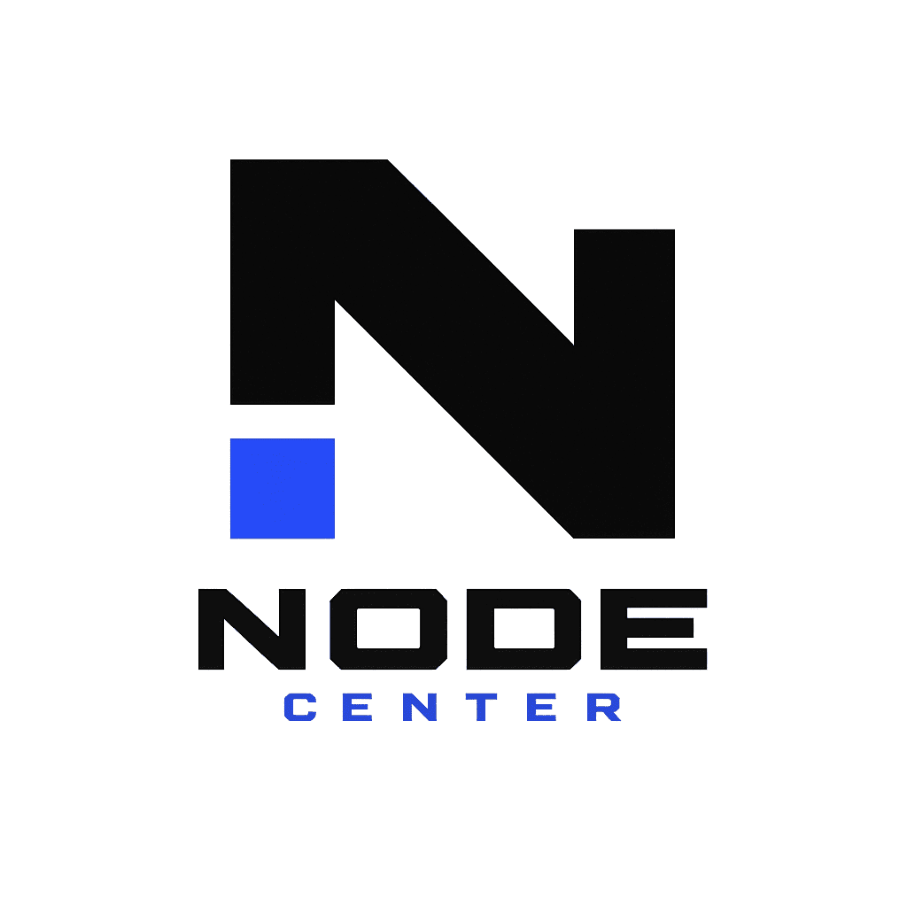

<p align="center">
  
</p>

<h1 align="center">Node Center - Application Monitoring Dashboard</h1>

<p align="center">
  Sebuah dashboard pemantauan aplikasi (Application Monitoring) berbasis Laravel 11 dengan antarmuka <strong>Neo-Brutalist</strong> modern. Dibuat khusus untuk mengawasi berbagai aplikasi Laravel secara terpusat, langsung (real-time), dan aman.
</p>

---

## ✨ Fitur Utama

- **Real-time Metrics (Push & Pull):** Menerima data secara instan dari aplikasi agen, sekaligus melakukan *Active Ping* ke server target untuk membedakan antara *Server Offline* dan *Agent Stale* (Cron Macet).
- **Incident History (Downtime Logs):** Secara otomatis mencatat setiap kali aplikasi mengalami *downtime*, menghitung durasi *offline*, dan menyimpan pesan *error*-nya (misal: HTTP 502, Timeout).
- **Manual Ping Tester:** Tombol uji coba Ping manual secara langsung dari Dashboard tanpa harus menunggu *scheduler*.
- **Historical Analytics (Chart.js):** Lacak penggunaan CPU, Memory, DB Latency, dan Cache Latency selama 24 Jam, 7 Hari, dan 30 Hari terakhir dalam grafik interaktif.
- **Multi-Tenancy Security:** Mendukung banyak *user* di mana setiap *user* hanya dapat melihat, mengedit, dan memantau aplikasinya sendiri (berbasis *User-ID isolation*).
- **Environment Security Scanner:** Secara otomatis memindai konfigurasi `.env` agen target untuk mendeteksi kerentanan kritis (seperti `APP_DEBUG=true` di tahap *Production* atau kunci rahasia yang kosong).
- **Slow Query & Error Catcher:** Menangkap log *Slow Queries* dan *Exceptions* dari file `laravel.log` agen target.
- **Queue & Schedule Tracker:** Memantau status *Pending Jobs*, *Failed Jobs*, dan *Scheduled Tasks (Cron)* dari jarak jauh.

---

## 🚀 Instalasi Dashboard (Node Center)

1. **Clone & Install Dependencies**
   ```bash
   git clone <repo-url> node-center
   cd node-center
   composer install
   npm install && npm run build
   ```

2. **Konfigurasi Lingkungan (.env)**
   Salin file `.env.example` ke `.env` dan atur koneksi database Anda.
   ```bash
   cp .env.example .env
   php artisan key:generate
   ```

3. **Migrasi Database**
   ```bash
   php artisan migrate:fresh
   ```

4. **Jalankan Scheduler & Server**
   Untuk mengaktifkan fitur pencatatan otomatis insiden (*Active Ping & Incident History*), jalankan Laravel Scheduler di server Dashboard:
   ```bash
   # Di background terminal atau crontab server
   php artisan schedule:work
   
   # Jalankan server
   php artisan serve
   ```

---

## 🔌 Cara Menyambungkan Aplikasi Target (Klien)

Untuk menyambungkan aplikasi Laravel Anda (contoh: SISMA-AKA) ke **Node Center**, ikuti langkah berikut:

### 1. Daftarkan Aplikasi di Node Center
1. Login ke **Node Center**.
2. Masuk ke menu **My Apps** > **+ New App**.
3. Masukkan Nama (Misal: "SISMA-AKA") dan URL Root aplikasi (Misal: `http://127.0.0.1:8001`).
4. Klik simpan. Anda akan mendapatkan **API Token** rahasia.

### 2. Konfigurasi Agen (Klien)
Pada aplikasi target (Klien), tambahkan baris berikut di akhir file `.env` Anda:
```env
# Konfigurasi Dashboard Monitor API
DASHBOARD_MONITOR_URL="http://127.0.0.1:8000"
DASHBOARD_API_TOKEN="API_TOKEN_YANG_DIDAPAT_DARI_NODE_CENTER"
```

### 3. Pasang Drop-in Command
Salin file `agent-script/SendDashboardMetrics.php` dari *repository* ini ke dalam direktori aplikasi agen Anda di jalur `app/Console/Commands/SendDashboardMetrics.php`. 
*(Catatan: Script ini sudah didesain "kebal" / robust terhadap limitasi keamanan cPanel atau Shared Hosting, sehingga tidak akan memicu fatal error meskipun fungsi pengecekan CPU/Disk diblokir oleh provider hosting).*

Lalu, daftarkan *command* tersebut di `routes/console.php` klien agar berjalan secara otomatis setiap menit:
```php
use Illuminate\Support\Facades\Schedule;

Schedule::command('dashboard:send-metrics')->everyMinute();
```
*(Pastikan Anda telah mendaftarkan Master Cron Job Laravel `* * * * * php artisan schedule:run` di cPanel atau server Anda).*

---

## 🛡️ Membaca Status Monitoring

Pada dashboard, Anda akan melihat indikator berikut:
- 🟢 **UP** (Ping Status): Server merespons ping HTTP dengan sukses (Status 200/300).
- 🔴 **DOWN** (Ping Status): Server tidak merespons (Timout / 500+). Ini otomatis akan memicu pencatatan **Incident History**.
- 🟢 **AGENT ONLINE**: Agen berhasil mengirim metrik CPU/Memory kurang dari 5 menit yang lalu.
- 🟡 **PING: UNKNOWN / AGENT STALE**: Menandakan konektivitas agen sedang bermasalah atau belum pernah terhubung.
- 🛡️ **WARNING (Shield Merah)**: Ditemukan kerentanan di `.env` aplikasi klien target. Klik logo tameng merah untuk melihat detailnya.

---
**Node Center** &copy; 2026. *Built for professionals.*
